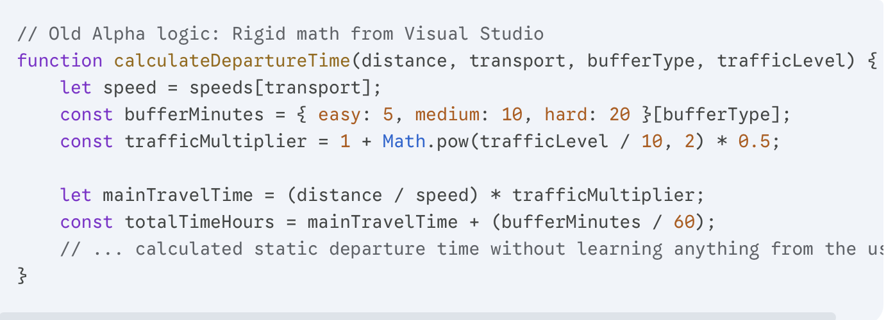
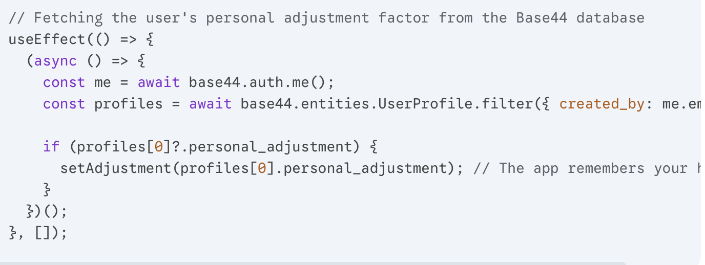
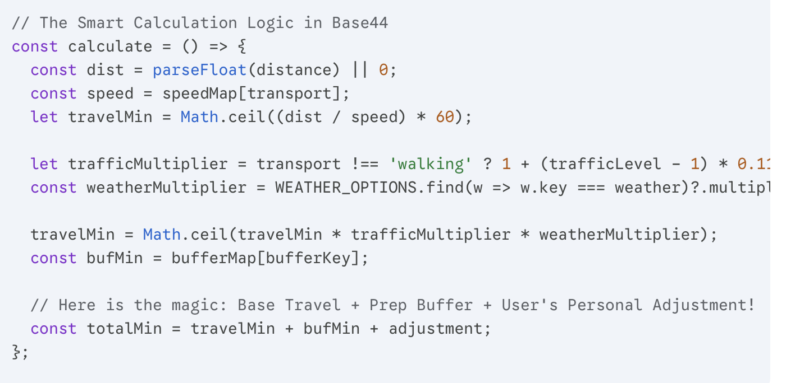

# LeaveRight Project Homepage

This is the homepage for the LeaveRight web application.

## Project Description

LeaveRight is a web app that helps users calculate the exact departure time to arrive on time.

## How to Deploy

1. Create a GitHub repository.
2. Push this code to the repository.
3. Enable GitHub Pages in the repository settings.
4. The public site link will be provided.

## Technologies

- HTML5
- CSS3
- JavaScript

## Authors

- Dair: Programming
- Maulen: Design

## Media files (videos)

Place development videos in a `media/` folder at the project root with these filenames:

- `alpha.mp4` — Alpha version video
- `beta.mp4` — Beta version video
- `final.mp4` — Final product video
- `alpha-interview.mp4` — Alpha stage interview video
- `beta-interview.mp4` — Beta stage interview video

Optional poster images (thumbnails) can be placed in the `images/` folder and named:

- `alpha-poster.jpg`
- `beta-poster.jpg`
- `final-poster.jpg`
- `alpha-interview-poster.jpg`
- `beta-interview-poster.jpg`

Example structure:

```
media/alpha.mp4
media/beta.mp4
media/final.mp4
media/alpha-interview.mp4
media/beta-interview.mp4
images/alpha-poster.jpg
images/beta-poster.jpg
images/final-poster.jpg
images/alpha-interview-poster.jpg
images/beta-interview-poster.jpg
```

After adding the files, open `index.html` in your browser and refresh the page to see embedded videos.

## Development process

### Evidence of Development

To prove Maulen and I built this app, here is the technical breakdown. We coded our initial Alpha version locally in Visual Studio using basic JavaScript. Later, we migrated the project to Base44 to build the Final version, which allowed us to use React and connect a real database to make the calculator much smarter.

**Code Evolution: From Simple Math to Smart Logic**

In the Alpha version, our code was just a rigid math formula. It calculated the travel time but completely ignored human habits or changing weather:

<figure style="border:1px solid #ccc;padding:12px;max-width:680px">
	
	<figcaption style="padding-top:6px;text-align:center">Место для фото — код Alpha версии</figcaption>
</figure>

For the Final version in Base44, Maulen and I made the app adaptive. First, the app connects to our Base44 database to check if the user has a history of being late, and pulls their personal time adjustment:

<figure style="border:1px solid #ccc;padding:12px;max-width:680px">
	
	<figcaption style="padding-top:6px;text-align:center">Место для фото — код Final версии (Base44)</figcaption>
</figure>

Next, our new logic applies live environmental multipliers (traffic/weather) and automatically injects the user's personal adjustment into the final formula:

<figure style="border:1px solid #ccc;padding:12px;max-width:680px">
	
	<figcaption style="padding-top:6px;text-align:center">Место для фото — код применения live multipliers</figcaption>
</figure>

**Visual Proof: Before vs. After**

- **The Inputs:** Alpha used standard, generic browser dropdowns that were tiny and hard to use. In the Final version, we built custom tile buttons with transport icons and sleek toggle pills.
- **The Map Layer:** Our old Visual Studio prototype had no route visualization, while our Base44 version features a real interactive map component.
- **Bug Fix:** In Alpha, deleting a history card used a crude script that forced a glitchy page reload. In the final product, Maulen and I fixed this so cards disappear instantly and smoothly using React states.
